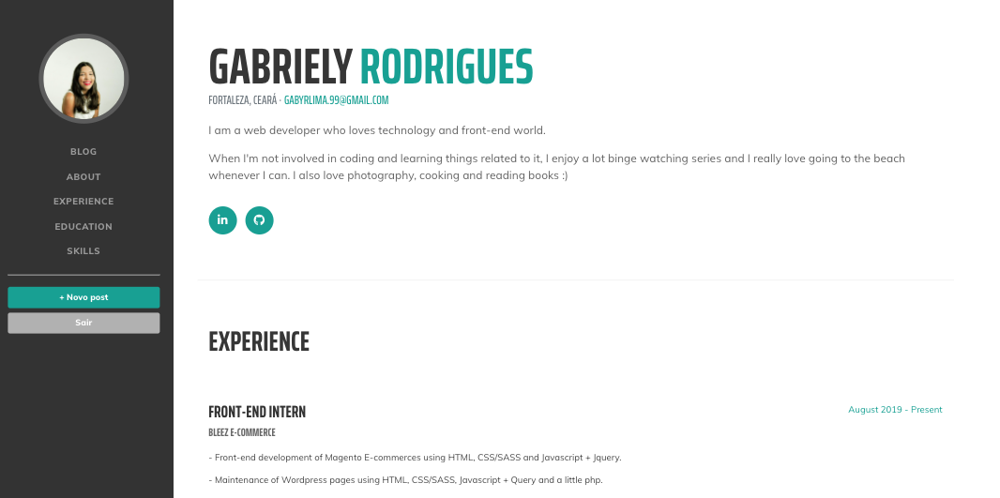

<h3 align="center" >
  	blog-rails is a blog and also a resume, where I share posts related to things that I like and also descriptions about myself and my career experiences!
</h3>
<p align="center">
	The layout of the application was based on a activity of Rocketseat Reboot event and you can access it on <a href="https://www.youtube.com/watch?utm_campaign=reboot__conteudo_live_5&utm_medium=email&utm_source=RD%20Station&v=MAjuVJ2XjaE" target="_blank">Youtube</a>.
</p>
<p align="center">
	The blog code was based on a Onebitcode article and you can access the post at their <a href="https://onebitcode.com/rails-bulma-criando-um-blog-do-zero-em-poucos-minutos/" target="_blank">blog</a>.
</p>

<p align="center">
  
  
  
  <a href="https://github.com/gabyrodrigues/ecoleta/commits/master">
    
  </a>
  <a href="https://github.com/gabyrodrigues" target="_blank">
    
  </a>
</p>

## :computer: Languages

- **Ruby on Rails**
- **Javascript**
- **HTML**
- **Bulma**
- **CSS**
- **SQL**

## :rocket: Running the application

- ### **Prerequisites**

  - It's **necessary** to install **[Ruby on Rails](https://gorails.com/setup/osx/10.15-catalina)** on your machine (Rails on version '~> 6.0.2', '>= 6.0.2.2' and Ruby on version 2.7.1)

1. Clone the application:

```
git@github.com:gabyrodrigues/blog-rails.git
```

2. Running the application:

```
  # Install the dependencies
  $ bundle install

  ## Create the database
  $ rails db:migrate
 
  # Run the API server
  $ rails s
```

## :book: Results





Developed by [Gabriely Rodrigues](https://github.com/gaby-rodrigues)
